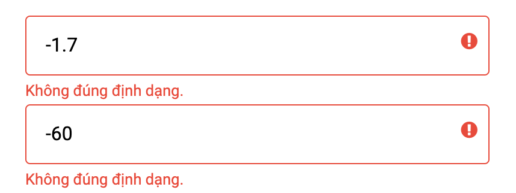

## Ứng dụng tính chỉ số BMI

Công thức tính:

```
BMI = weight / (height * height)

Trong đó:
- weight : Cân nặng (kg)
- height : Chiều cao (m)
```

Bao gồm các chức năng:
- Check validate ở các ô
- Tính toán chỉ số và hiển thị

### Giao diện

Học viên tự tạo giao diện cho ứng dụng

Giao diện mẫu


### Validate ở các ô

Nội dung cần kiểm tra:

- Nội dung có để trống hay không? Nếu có thì thông báo lỗi validate ngay bên dưới ô input


- Nội dung có đúng định dạng hay không (Nếu nhập ký tự khác số và nhập số âm)



### Tính toán chỉ số và hiển thị

Một số mức BMI

- BMI < 18.5


- 18.5 < BMI < 24.9


- 24.9 < BMI < 29.9


- BMI > 29.9


